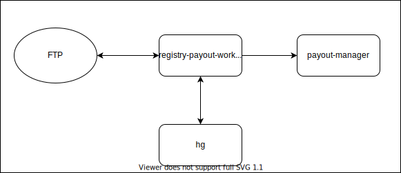

# registry-payout-worker

Сервис, предназначенный для формирования выплат из реестров провайдера.

## Описание работы сервиса

Сервис формирует выплаты на основе реестров, которые он получает фтп-сервера.
На фтп уже создана директория для реестров (/home/registry) с поддиректориями 
для реестров провайдера. 
Файлы реестров от провайдера загружаюся на фтп вручную в директорию, соответствующую названию провайдера.

- С заданным интервалом времени сервис подключается к фтп и читает поочередно директории и файлы. 
В результате прочтения каждой директории должен вернуться объект PayoutStorage, содержащий в себе сумму операций и 
валюту по всем файлам провайдера, сгруппированные по partyId и shopId.
- По названию директории выбирается необходимый обработчик для файлов. 
Обработчик парсит файл в объект TransactionsStorage, который содежит в себе списки объекта Transaction отдельно
по платежам и возвратам.  Transaction - это id, сумма и валюта операции, полученная из файла.
- Далее обработчик должен сгруппировать операции по party, shop, для чего необходимо запросить в 
сервисе hellgate данные по каждой операции. 
Обращение по каждой операции необходимо, так как в одном файле могут содержаться операции по разным shopId. 
- Сгруппированные Transaction из файла маппятся в Payout - сумму всех операций и валюту и 
сохраняются в PayoutStorage. Сам файл реестра перемещается в каталог "processed".
- Из PayoutStorage создается выплата по каждому party, shop и отправляется в сервис payout-manager.

Схема работы сервиса:

Сервис взаимодействует с ftp, hellgate и payout-manager.

### Взаимодействие с ftp

Файлы реестров, полученные от провайдера, помещаются в директорию для провайдера.
Сервис читает файлы реестров из директории, в зависимости от названия директории выбирает обработчик для реестров, 
считывает операции. После прочтения файлы перемещаются в директорию для обработанных реестров.

### Взаимодействие с hellgate

Сервис запрашивает hellgate для получения party и shop
 по операциям и группирует ранее полученные из реестра операции по party, shop.

### Взаимодействие с сервисом payout-manager

Протокол взаимодействия описан [тут](https://github.com/rbkmoney/payout-manager-proto).
Сервис расчитывает сумму и валюту выплаты для магазина на основе сгруппированных ранее данных
и отправляет запрос к сервису payout-manager.

Общая схема взаимодействия отображена ниже:

